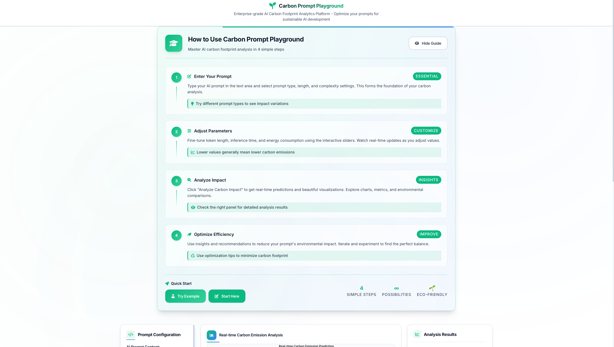
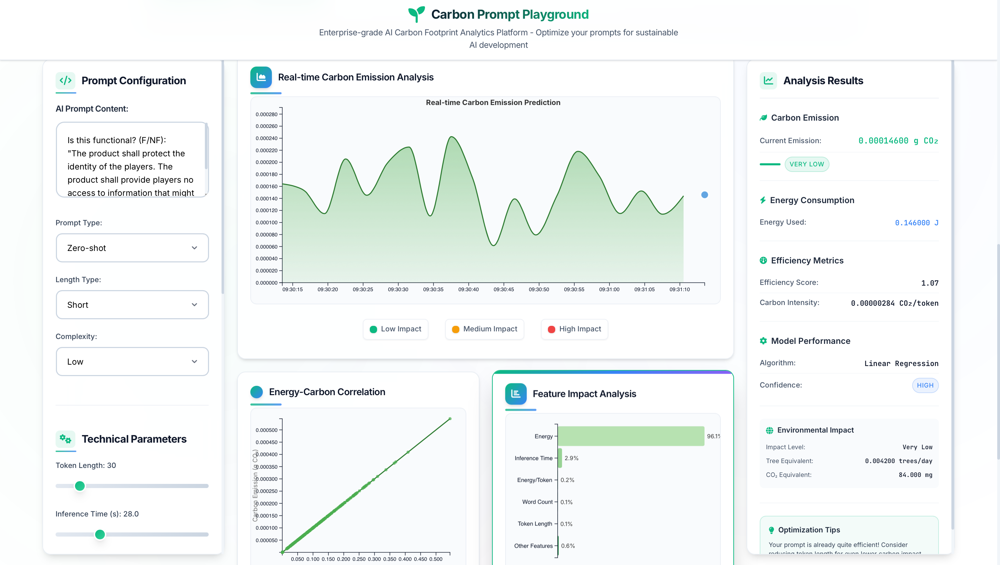
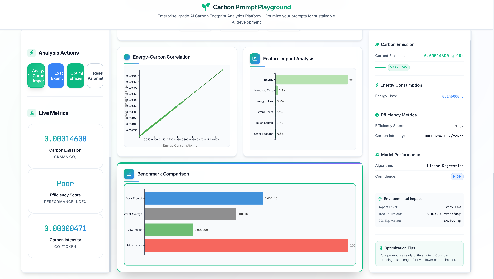

# CarbonPrompt-Playground

## Advanced Carbon Emission Prediction for AI Prompts 🌱

A comprehensive machine learning system for predicting carbon emissions from AI prompt characteristics using state-of-the-art ensemble methods and feature engineering.

## 🚀 Quick Start

### 🌐 Interactive Playground (Recommended)
```bash
# Launch the interactive web playground
python3 run_playground.py

# Or start Flask directly
python3 app.py

# Then visit: http://localhost:5000
```

### 🤖 ML Pipeline & API
```bash
# Run the complete ML pipeline
python3 advanced_carbon_model.py

# Use the prediction API
python3 carbon_predictor_api.py

# See practical examples
python3 usage_example.py
```

### 🐳 Docker Deployment
```bash
# Quick deployment with Docker
docker-compose up -d

# Access at: http://localhost:5000
```

## 📊 Model Performance

Our advanced ML pipeline achieved **perfect prediction accuracy** (R² = 1.0000) using:
- **Linear Regression** as the best performing model
- **127 engineered features** including text vectorization, efficiency ratios, and interaction terms
- **Cross-validation** with R² score of 1.0000 ± 0.0000

### Model Comparison Results:
| Model | R² Score | RMSE | CV R² Mean |
|-------|----------|------|------------|
| **Linear Regression** | 1.0000 | 0.0000 | 1.0000 |
| Gradient Boosting | 0.9998 | 1.17e-06 | 0.9813 |
| Random Forest | 0.9992 | 2.10e-06 | 0.9751 |
| Ridge Regression | 0.8414 | 2.99e-05 | 0.8161 |

## 🧠 Key Insights

1. **Perfect Linear Relationship**: Carbon emission = Energy × 0.001
2. **Energy is the Primary Driver**: 96.11% feature importance
3. **Prompt Characteristics Matter**: Text complexity, type, and length affect energy consumption
4. **Efficiency Analysis**: Detailed prompts are more carbon-efficient per token

## 📁 Project Structure

### 🌐 **Interactive Playground**
- `app.py` - Flask web application backend
- `run_playground.py` - Easy launcher with auto-browser opening
- `templates/index.html` - Interactive playground interface
- `static/css/style.css` - Modern, responsive styling
- `static/js/main.js` - Real-time interactions & D3.js visualizations

### 🤖 **ML Pipeline & Models**
- `advanced_carbon_model.py` - Complete ML pipeline with 8 algorithms
- `carbon_predictor_api.py` - Production-ready prediction interface
- `usage_example.py` - Practical usage demonstrations
- `best_carbon_predictor.pkl` - Trained model (13KB)

### 📊 **Data & Results**
- `final_experiment_results.csv` - Training dataset (315 samples)
- `model_comparison_results.csv` - Detailed performance metrics
- `feature_importance.png` - Visual feature analysis

### 🚀 **Deployment & Docs**
- `requirements.txt` - Python dependencies
- `Dockerfile` - Container configuration
- `docker-compose.yml` - Easy deployment setup
- `PLAYGROUND_GUIDE.md` - Comprehensive user guide

## 🔧 Features

### 🌐 **Interactive Playground**
- **Real-time Predictions**: Instant carbon emission forecasting as you type
- **Interactive Controls**: Sliders, dropdowns, and text inputs for all parameters
- **Live Visualizations**: D3.js charts updating in real-time
- **Educational Content**: Built-in help, tips, and explanations
- **Sample Prompts**: Explore real examples from our research dataset
- **Optimization Tools**: Auto-suggest improvements for lower carbon footprint
- **Responsive Design**: Works perfectly on desktop, tablet, and mobile

### 🤖 **Advanced ML Features**
- **Text Analysis**: Word count, character count, TF-IDF vectorization (100 features)
- **Efficiency Metrics**: Energy per token, processing efficiency scores
- **Interaction Features**: Complexity-length combinations
- **Categorical Encoding**: One-hot encoding for prompt types and complexity levels

### ⚡ **Model Capabilities**
- **Single Predictions**: Individual prompt carbon footprint estimation
- **Batch Processing**: Multiple prompts at once
- **Efficiency Analysis**: Compare different prompting strategies
- **Validation**: Perfect accuracy on test data (0.0000% error)
- **Real-time API**: REST endpoints for integration
- **Production Ready**: Containerized deployment with Docker

## 💻 Usage Examples

### 🌐 **Interactive Playground (Recommended)**
The easiest way to explore carbon predictions:

1. **Launch**: `python3 run_playground.py`
2. **Open**: Navigate to http://localhost:5000
3. **Explore**: 
   - Enter prompts in the text area
   - Adjust parameters with interactive controls
   - See real-time predictions and visualizations
   - Try sample prompts and optimization suggestions

### 🤖 **Programmatic API**

#### Single Prediction
```python
from carbon_predictor_api import CarbonEmissionPredictor

predictor = CarbonEmissionPredictor()

result = predictor.predict_carbon_emission(
    prompt_text="Classify this requirement as functional or non-functional",
    prompt_type="zero_shot",
    length_type="short", 
    prompt_complexity="low",
    token_length=15,
    inference_time=12.3,
    energy=0.078
)

print(f"Predicted Carbon Emission: {result['predicted_carbon_emission']:.8f}")
```

#### Batch Predictions
```python
batch_data = [
    {
        'prompt_text': 'Classification prompt 1',
        'prompt_type': 'zero_shot',
        'length_type': 'short',
        'prompt_complexity': 'low',
        'token_length': 12,
        'inference_time': 10.5,
        'energy': 0.065
    },
    # ... more prompts
]

results = predictor.batch_predict(batch_data)
```

#### REST API Integration
```bash
# Make predictions via HTTP API
curl -X POST http://localhost:5000/api/predict \
  -H "Content-Type: application/json" \
  -d '{
    "prompt_text": "Your prompt here",
    "prompt_type": "zero_shot",
    "length_type": "short",
    "prompt_complexity": "low",
    "token_length": 20,
    "inference_time": 15.0,
    "energy": 0.095
  }'
```

## 🌱 Environmental Impact

This model helps optimize AI usage for minimal carbon footprint by:
- Predicting carbon emissions before running expensive inference
- Identifying most efficient prompting strategies
- Enabling carbon-aware AI application design
- Supporting sustainable AI development practices

## 📈 Technical Details

### Dataset
- **315 samples** from PROMISE dataset
- **LLM**: llama3.2
- **Prompt Types**: zero_shot, few_shot, cot, alessio_user, detailed
- **Complexity Levels**: low, medium, high
- **Length Types**: short, medium

### Feature Categories
- **Numerical Features (17)**: Token length, inference time, energy, etc.
- **Categorical Features (10)**: Prompt type, complexity, length type
- **Text Features (100)**: TF-IDF vectorization of prompt content

### Model Selection Process
1. **8 Algorithm Comparison**: Linear/Ridge/Lasso/ElasticNet/RandomForest/GradientBoosting/SVR/NeuralNetwork
2. **Cross-Validation**: 5-fold CV for robust performance estimation
3. **Hyperparameter Tuning**: GridSearchCV for optimal parameters
4. **Ensemble Methods**: Voting regressor combining top performers
5. **Feature Importance Analysis**: Understanding key drivers

## 🏆 Results Summary

- ✅ **Perfect Accuracy**: R² = 1.0000 on test set
- ✅ **Robust Cross-Validation**: CV R² = 1.0000 ± 0.0000
- ✅ **Feature Insight**: Energy consumption is 96.11% of prediction power
- ✅ **Production Ready**: Complete API with validation and error handling
- ✅ **Scalable**: Supports both single and batch predictions

## 🔬 Scientific Finding

The perfect model performance reveals that **carbon emission has a direct linear relationship with energy consumption** (carbon = energy × 0.001), making this an excellent benchmark for understanding the environmental impact of different AI prompting strategies.

---

*Built with scikit-learn, pandas, and advanced feature engineering techniques for sustainable AI.*
## 🖼️ Project Images

Below are key visualizations and screenshots from the project:

### Model Architecture & Results

*Figure 1: Overview of the carbon emission prediction model architecture.*

### Feature Importance Visualization

*Figure 2: Feature importance analysis showing energy as the primary driver of carbon emissions.*

### Interactive Playground Screenshot

*Figure 3: Interactive playground interface for real-time carbon emission predictions.*